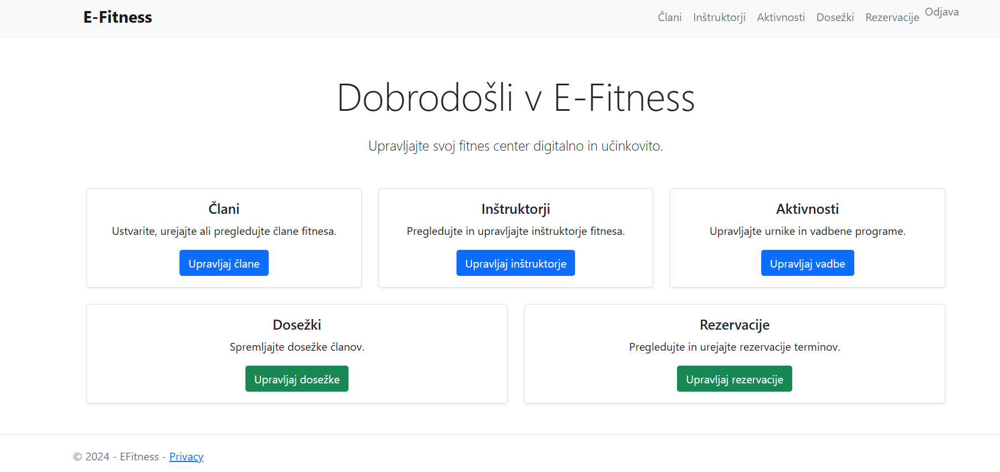
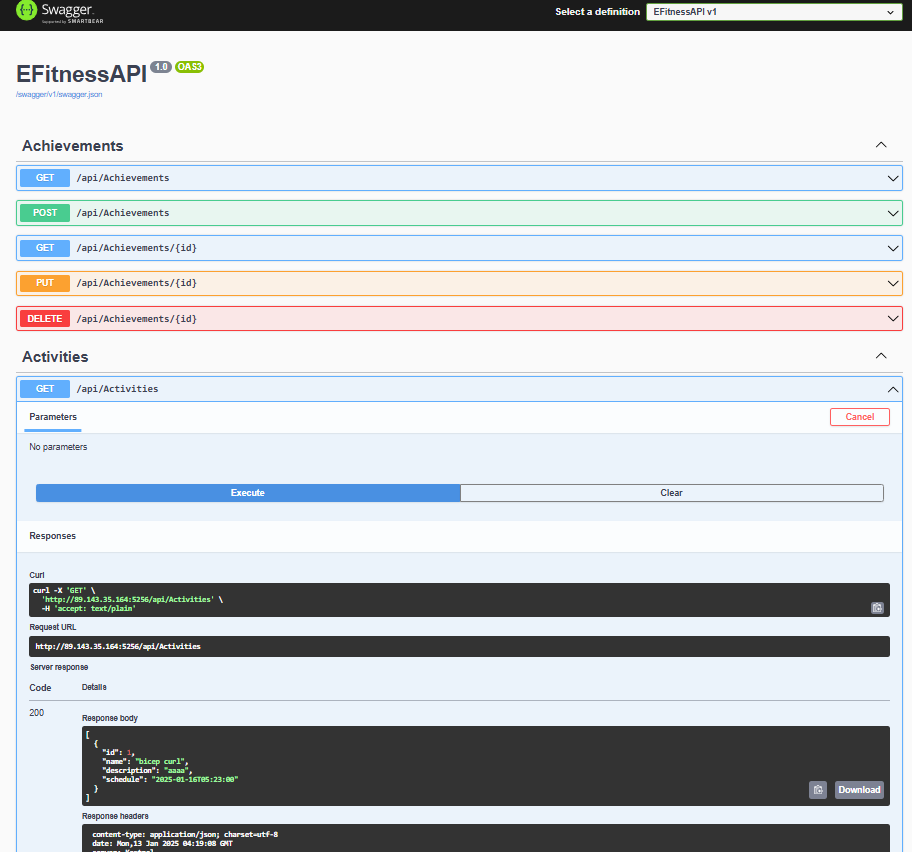
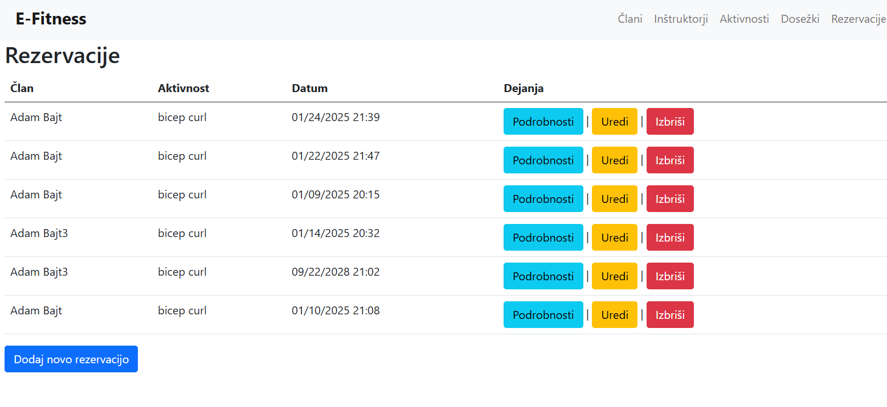
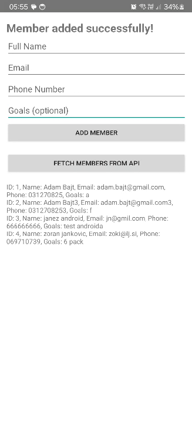
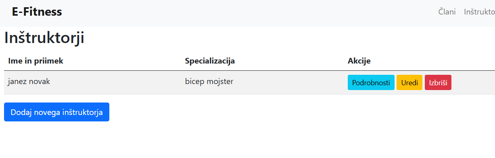
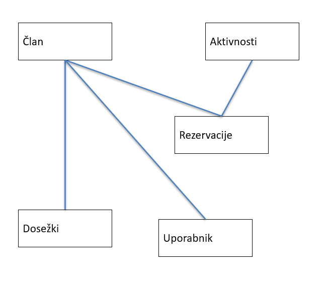

# E-Fitness

## 1. Opis projekta

**E-Fitness** je celovit sistem za upravljanje fitnes storitev. Sestavljen je iz:
- **Spletne aplikacije** (ASP.NET Core) za vodenje članov, aktivnosti, rezervacij, dosežkov in še več.
- **API** ki omogoča komunikacijo s podatkovno bazo.
- **Mobilna aplikacija**, ki lahko prikazuje podatke in omogoča interakcijo z vodenim fitnes sistemom.

Cilj projekta je zagotoviti enostavno upravljanje fitnes centra, kjer lahko skrbniki:
- dodajajo in urejajo člane (člani imajo ime, priimek, cilje, ipd.),
- organizirajo aktivnosti (npr. joga, crossfit, vodena vadba),
- vodijo rezervacije (termini, razpoložljivost),
- beležijo dosežke (npr. osebni rekordi, nagrade).

Vsa funkcionalnost je dostopna prek prijave. Neavtorizirani uporabniki nimajo dostopa do urejanja podatkov.
Povezava do webappa: https://efitness-app-bca6g5cqewb7h7cj.northeurope-01.azurewebsites.net/
Povezava do API: http://89.143.35.164:5256/index.html (ni na Azuru, ker me Azure ne mara) - Je na mojem lastnem računalniku.
Aplikacijo si lahko namestite iz app/release/EFitnessApp.apk datoteke na svojem telefonu.
API je kljub localhostingu povezan na bazo podatkov v azuru. Aplikacija uporablja API.

---

## 2. Avtor in prispevek

- **Ime in priimek**: Adam Bajt  
- **Vpisna številka**: 63210380  

---

## 3. Zaslonske slike

Spodaj je nekaj zaslonskih slik iz **spletne aplikacije** in **mobilne aplikacije** za predstavitev uporabniškega vmesnika.

### 3.1 Zaslonska slika spletne aplikacije

### 3.2 Zaslonska slika API

### 3.3 Zaslonska slika rezervacij

### 3.4 Zaslonska slika mobilne aplikacije

### 3.5 Zaslonska slika inštruktorjev

---

## 4. Kratek opis delovanja sistema

1. **Prijava in upravljanje vlog**: Uporabniki se prijavijo prek ASP.NET Identity sistema. Skrbniki imajo dostop do funkcij za dodajanje, urejanje in brisanje podatkov.
2. **Člani**: Omogoča dodajanje in pregled članov (ime, priimek, email, cilji itd.).
3. **Inštruktorji**: Upravljanje oseb, ki izvajajo aktivnosti.
4. **Aktivnosti**: Seznam različnih vadbenih programov (npr. joga, kardio, crossfit) z urniki.
5. **Rezervacije**: Vsak član lahko rezervira določen termin pri določeni aktivnosti.
6. **Dosežki**: Beleženje pomembnih mejnikov (osebni rekordi, nagrade, uvrstitve na tekmovanjih itn.).

Sistem uporablja **Entity Framework** za povezavo z MS SQL bazo, kjer so shranjeni vsi podatki.

---

## 5. Naloge in prispevek

Ker sem bil edini avtor projekta, sem opravil vse naloge:
- **Postavitev in konfiguracija** ASP.NET Core projekta,
- **Implementacija podatkovnega modela** (člani, aktivnosti, rezervacije, dosežki, …),
- **Izdelava API-ja / kontrolerjev** za pregled in urejanje podatkov,
- **Implementacija varnosti in pristopa** (prijava, odjava, avtentikacija z Identity),
- **UI in UX**: Spletni vmesnik (Razor Pages / MVC) in mobilni vmesnik,
- **Povezava z bazo** s pomočjo Entity Framework in inicializacija podatkov (seme),
- **Testiranje** (preverjanje delovanja funkcionalnosti in odpravljanje napak).

---

## 6. Podatkovni model

Spodaj je slika podatkovnega modela (ERD) iz orodja SSMS ali drugega orodja:

**Opis:**
- **Member**: Tabelarično shranjuje člane (Id, FullName, Email, Phone, Goals).
- **Activity**: Podatki o posamezni aktivnosti (Id, Name, Description, Schedule).
- **Reservation**: Povezuje `Member` in `Activity` (tuji ključi) ter shranjuje datum rezervacije.
- **Achievement**: Beleži dosežke posameznega člana (Id, MemberId, Description, DateAchieved).
- **ApplicationUser** (Identity): Vključuje podatke za prijavo in povezavo z vlogami (Admin, Staff).

